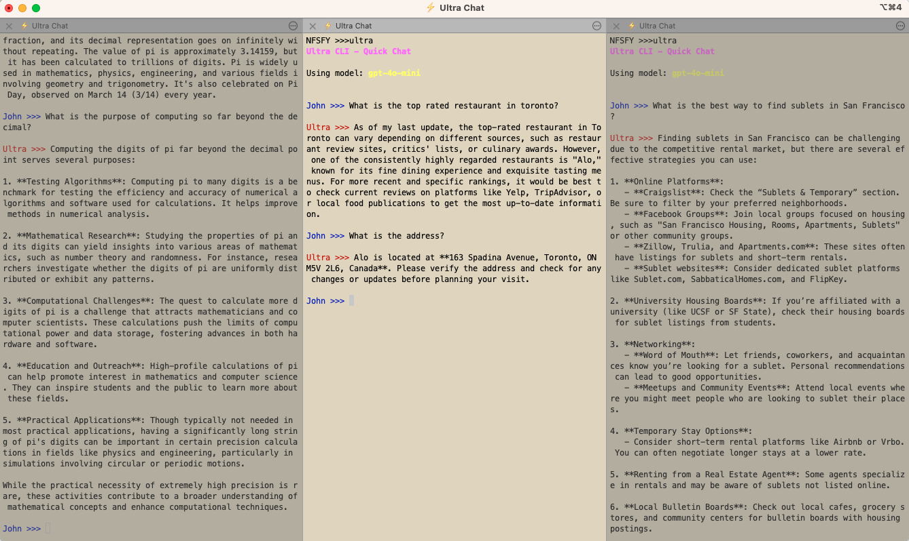

# ⚡ Ultra CLI

`Ultra` is a command-line tool for interacting with various LLM (Large Language Model) providers. It supports multi-turn conversations, and context management between sessions, and other useful features such as context clearing, and context compacting (eg summarizing the current session chat history to reduce token count).



Ultra works with any terminal, but this screenshot is from [iTerm2](https://github.com/gnachman/iTerm2) which allows for vertical splitting of the window so you can have multiple chat sessions side by side for quick research, each maintaining their own context window.

## Features
- Multiple provider extensibility (OpenAI by default).
- Model selection and dynamic switching.
- Session-based context storage, with options to export the history.
- Lightweight terminal UI with color-coded prompts.
- Configurable ASCII art welcome screen.
- Basic streaming support for partial response updates.

## Installation

1. Clone the repository:

    ```bash
    git clone https://github.com/your-github-account/ultra-cli.git
    ```
2. Change into the directory and install:

    ```bash
    cd ultra-cli
    pip install .
    ```

3. Quickstart with:

    ```bash
    ultra
    ```
4. Custom start with a specific model:

    ```bash
    ultra models
    ```

Optionally set environment variables:
```bash
export OPENAI_API_KEY=your_openai_api_key