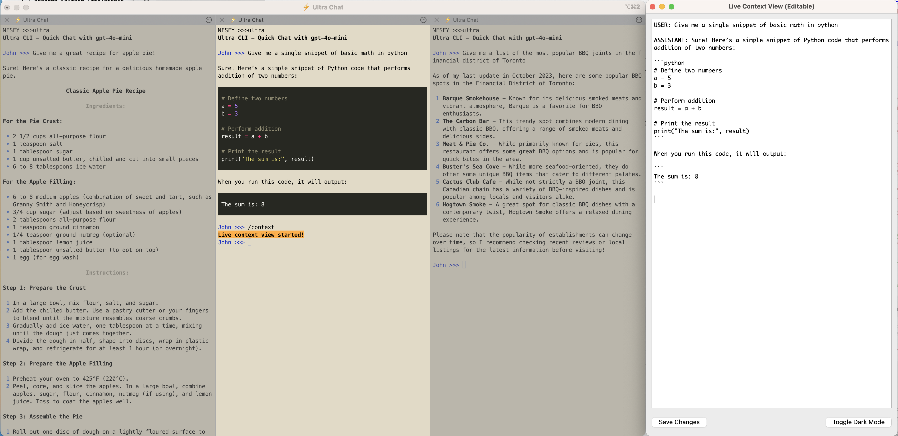

# ⚡ Ultra CLI

`Ultra` is a powerful command-line tool designed for engineers and developers who need advanced control over their LLM (Large Language Model) interactions. Break free from browser-based interfaces and integrate AI capabilities directly into your terminal workflow.



Ultra works with any terminal, but this screenshot is from [iTerm2](https://github.com/gnachman/iTerm2) which allows for vertical splitting of the window so you can have multiple chat sessions side by side for quick research, each maintaining their own context window. The `Live Context Window (editable)` (LECW) window is availble for *each* chat via the `/context` command and gives you and independent GUI with fine grain control over the entire context window. The above demo image shows the LECW for the chat in the middle of the image.

## Key Features

### Core Capabilities
- **Provider Flexibility**: Extensible architecture supporting multiple LLM providers (OpenAI by default)
- **Dynamic Model Switching**: Seamlessly switch between different models during a session
- **Context Management**: Session-based storage with export options and context compaction
- **Terminal-Optimized UI**: Color-coded prompts and efficient interaction patterns
- **Response Streaming**: Real-time updates as the model generates responses

### Advanced Features

#### Live Editable Context Window (LECW)
Launch a separate GUI window that displays your conversation context in real-time and allows direct editing:
- **Bidirectional Synchronization**: Changes in either interface propagate to the other
- **Direct Role and Content Editing**: Fine-tune prompts and control model behavior
- **Process Separation**: GUI operates independently from the terminal interface

#### YouTube Transcription
Convert YouTube videos into professionally formatted documents with a single command:
- **High-Quality Transcription**: Uses Whisper model for accurate speech recognition
- **AI-Enhanced Formatting**: Improves readability and corrects transcription errors
- **Rich Metadata Integration**: Captures video details like title, duration, and metrics
- **Professional Document Output**: Creates well-structured Word documents

## For Engineers, By Engineers

Ultra CLI is built specifically for engineers and technical users who:
- Need precise control over model inputs and outputs
- Want to integrate AI capabilities into their development workflow
- Prefer terminal-based tools for efficiency and scriptability
- Require advanced features beyond what browser interfaces provide

## Installation

1. Clone the repository:

    ```bash
    git clone https://github.com/your-github-account/ultra-cli.git
    ```
2. Change into the directory and install:

    ```bash
    cd ultra-cli
    pip install .
    ```

3. Quickstart with:

    ```bash
    ultra
    ```
4. Custom start with a specific model:

    ```bash
    ultra models
    ```

Optionally set environment variables:
```bash
export OPENAI_API_KEY=your_openai_api_key
```

## Command Reference

| Command | Description |
|---------|-------------|
| `/model` | Switch to a different model |
| `/clear` | Clear the current context |
| `/save` | Save the current session |
| `/export` | Export conversation as text |
| `/compact` | Summarize context to reduce token count |
| `/context` | Launch the Live Editable Context Window |
| `/transcribe` | Convert a YouTube video to text document |
| `/quit` or `/exit` | Exit the application |